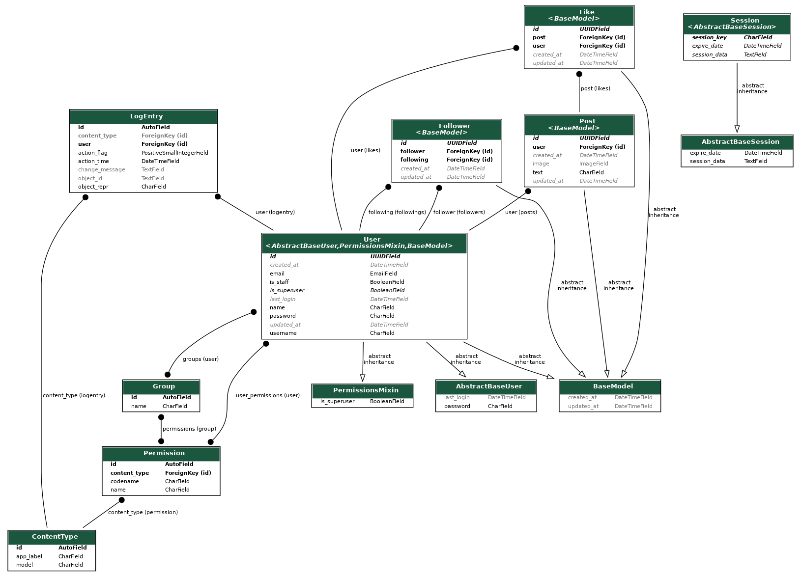

# mini-twitter-b2bit
Project for Backend Python Developer Selection for b2bit


## Instructions to run the project 

1) Clone the project:
```bash
git clone https://github.com/PedroRegisPOAR/mini-twitter-b2bit.git \
&& cd mini-twitter-b2bit \
&& git checkout main
```

2) You need to have `docker`, `docker-compose` and `make` installed:
```bash
make up
```

Acessing the API, swagger or the admin page:
- http://localhost:8000/api
- http://localhost:8000/api/swagger
- http://localhost:8000/admin


If running with your local python:
```bash
python3 -m venv .venv \
&& source .venv/bin/activate \
&& pip3 install --requirement requirements.txt
```

```bash
python manage.py migrate \
&& python manage.py runserver
```


### Extras: testing, coverage and entity-relationship diagram


Running the tests:
```bash
make test
```


Generating coverage:
```bash
make coverage
```


```bash
make erd
```

Exemple of expected result:



#### logs of database and API

Checking API logs:
```bash
docker-compose logs --follow apidrf 
```

Checking database logs:
```bash
docker-compose logs --follow db 
```


### Installing docker and docker-compose


Installing docker:
```bash
echo 'Start docker instalation...' \
&& curl -fsSL https://get.docker.com | sudo sh \
&& docker --version \
&& (getent group docker || sudo groupadd docker) \
&& sudo usermod -aG docker "$(id -nu)" \
&& sudo chown -v root:"$(id -gn)" /var/run/docker.sock \
&& docker run --rm docker.io/library/alpine cat /etc/os-release  \
&& docker images \
&& echo 'End docker instalation!'
```
Refs.:
- https://unix.stackexchange.com/a/740098
- https://unix.stackexchange.com/a/517319
- https://github.com/moby/moby/issues/39869#issuecomment-981563758
- https://superuser.com/a/609141


Installing docker-compose:
```bash
sudo curl -L \
"https://github.com/docker/compose/releases/latest/download/docker-compose-$(uname -s)-$(uname -m)" \
-o /usr/local/bin/docker-compose \
&& sudo chmod +x /usr/local/bin/docker-compose \
&& docker-compose --version
```
